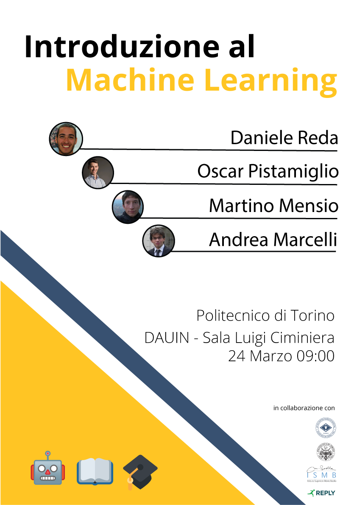

# practical-intro-ml

*24/03* Practical intro to Machine Learning in Python with scikit-learn and AutoML strategies

### Code and Slides

[Slides](https://raw.githubusercontent.com/jimmy-sonny/practical-intro-ml/master/intro_ml.pdf) and 
[Notebook](https://github.com/jimmy-sonny/practical-intro-ml/blob/master/sklean%20LinearRegression%20vs%20TPOT.ipynb)

